Simple Autonomous Wheeled Robot (SAWR)
======================================
Assembly Instructions
---------------------

The SAWR is a simple learning platform for autonomous robotics. Despite its
small size and low cost, it is capable of performing advanced mobile robotics
tasks, including simultaneous localization, mapping, and navigation.

The purpose of the SAWR is to provide a starting point for people who would
like to learn more about advanced mobile robotics, in particular autonomous
navigation and ROS, the Robot Operating System.

This simple robot (and its software stack) can also serve as a starting point
for those seeking to develop more sophisticated robots based on the
Intel&reg; RealSense&trade; Robotic Development Kit (RDK).

All frame components for the SAWR are parametrically designed with
[OpenSCAD](http://www.openscad.org/) and can be easily adjusted to accommodate
geometry of new electronic components if required. In addition to the 
Intel&reg; RealSense&trade; RDK, the frame also already has mounting points
for the Intel&reg; Joule&trade; development kit and the more advanced
Intel&reg; RealSense&trade; ZR300 3D camera.

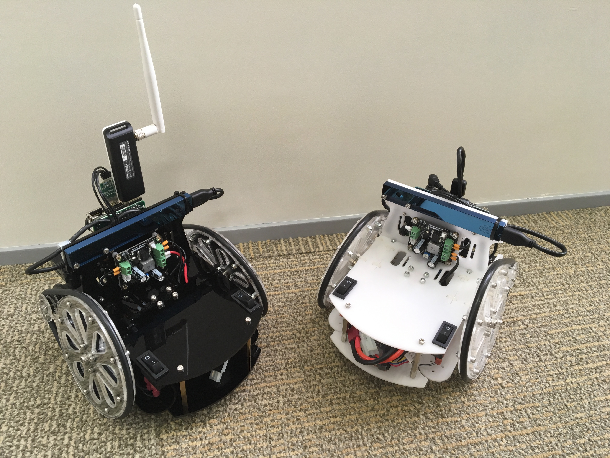

The SAWR uses easily available off-the-shelf parts. This makes it possible to 
assemble a robot using locally-sourced and relatively inexpensive components.
The SAWR's locomotion is based on two Dynamixel MX-12W servos. While these are
a more "exotic" part these motors provide accurate odometry feedback and speed
control, and are well-supported by ROS and the robotics community. Since they
have internal MCUs the need for an external MCU and motor drivers is
eliminated, simplifying the overall design.

This document outlines all mechanical/electronic components and assembly steps
of the SAWR. Images have been included in the SAWR package to go with this 
file but links are also provided to additional files and even 3D models as
appropriate.

Mechanical Assembly and Electrical Wiring
-----------------------------------------

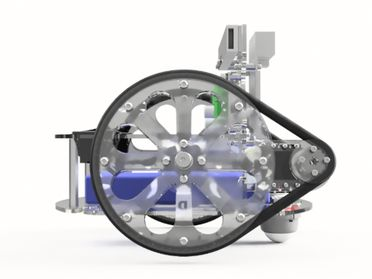
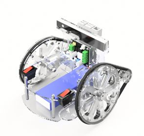

All mechanical drawings, 3D assemblies, and electrical schematics presented
in this document are also available in the form of web links to CAD cloud
storage. In general, the online versions of these images and models may be 
more up-to-date than the images in this document, in addition to allowing
interaction, such as rotating a 3D model. Therefore, please follow the links
provided in any case where a clearer view is needed or to ensure you have the
latest version of the figure. You can also use OpenSCAD to look at the model
locally.

Fastener specifications and part numbers are provided in the [BOM](Materials) 
and 2D drawings.
Part numbers are from the [McMaster-Carr catalog](http://www.mcmaster.com/).
All fasteners are sized in metric. In many cases equivalent parts can be
substituted, so in addition to McMaster-Carr part numbers we also provide
(in BOM and drawings) generic specifications of each part so you can find
appropriate substitute parts if necessary.

Generally a 10% tolerance is assumed for the thickness of the plates making
up the frame and for the sizes of holes. For example, the slots for tabs on 
3mm plates are actually 3.3mm wide so plates that are a little thicker than
they are supposed to be will still work. The same is true for most bolt holes;
an M3 bolt hole is generally 3.2mm in diameter (the threaded part of an M3 bolt 
is actually slightly less than 3mm in diameter). This allows for both
manufacturing variance (eg for plates, which can very in thickness even within
a single sheet) and for the use of Imperial substitutions for bolts. One
exception however where an accurate size is needed is for the bearings and the
bolt used for the wheel axle. These must be exact as a press fit is used so 
either get metric bolts and bearings or edit the CAD files and/or PDF files
before cutting if you must make substitutions.

Cut sheets and instructions for making a frame are in the [Make](Make/README.md)
subdirectory.

Here is [a drawing](http://a360.co/2a88Qpd) of all laser cut components with 
the names we will be using to refer to them in the assembly notes.

The Tower plate provides the option to mount either the RDK kit (UP board and 
Intel RealSense R200) or an Intel Joule Development Kit with an Intel RealSense
ZR300 camera. It is also possible to combine a Joule with an R200 camera.

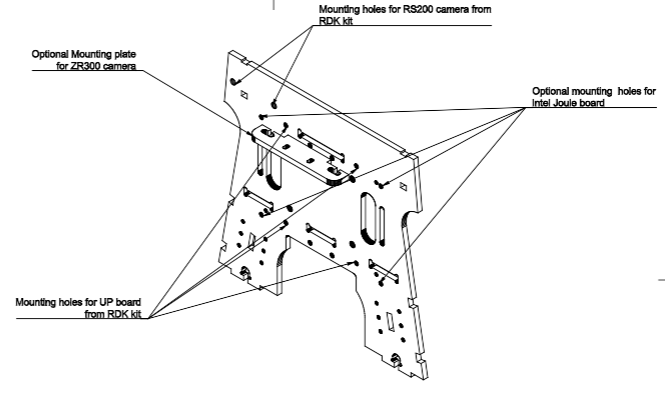

Here is a Bill of Materials (BOM), with estimated cost of parts. The links are for reference only; you may be able to find alternative suppliers for these parts.

Select Download from the following web pages:
* [Download BOM (Bill of Materials) in XLS format](http://a360.co/2c8y1bV)
* [Download BOM (Bill of Materials) in CSV format](http://a360.co/2c8xRBg)

A local version of the BOM is also available, but may be out of date:
* [Local BOM (Bill of Materials) in CSV format](Materials/BOM_RDK.csv)

Wheels Assembly
---------------

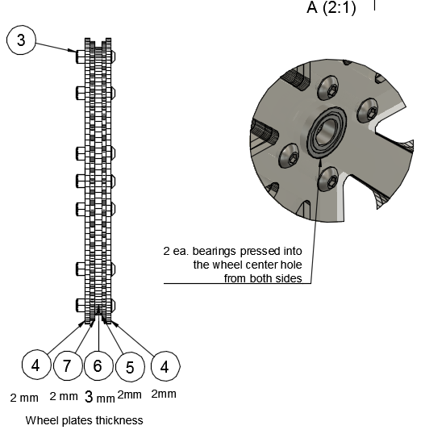

[_Drawing 1_](http://a360.co/29UsC8R)
([Wheel 3D Assembly](http://a360.co/2agnle2))

Wheels are assembled from five layers of laser cut components. This allows the
outer profile of the wheel to have a "U" shape to capture an O-ring tire, which
is also used as a belt drive. The center layer of each wheel is 3mm thick, and
all other layers are 2mm thick, providing 7mm clearance for the belt/tire
between the two outer layers of the wheel. The total wheel thickness is 11mm.

Assembly:

1. Press in two bearings into the center holes of two pairs of the outer 2mm
   wheel layers. This is easiest before bolting the wheel layers together as
   you can press in the bearing using a flat surface.

2. Secure all 5 layers of the wheel with 12 ea. M3 lock-nuts and M3x14 screws.
   The central layer's hole is slightly smaller than the outer diameter of the
   bearing, so the bearings will not pass through the center layer.

3. Repeat for the second wheel.

Frame Assembly
--------------

It is advisable to assemble the rest of the robot in the order given below.
Note the location of the holes on the top of the tower: the orientation of the
tower plate matters, it is not reversible!  The mounting holes for the 
single-board computers and the camera are not reversible.

Assembly:

1. Attach components to the Tower plate in the following order given by 
   Drawings 2A, 2B, and 2C below. 

  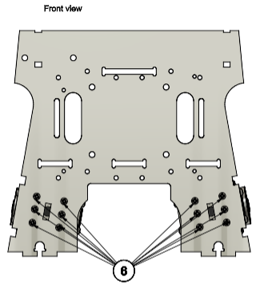
  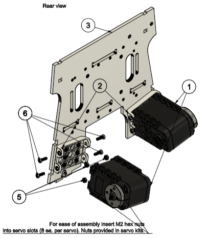
     
   [_Drawing 2A_](http://a360.co/2covpJj)
   ([Tower 3D Assembly](http://a360.co/2ago66G))
      
* Attach two brackets to the tower. For each bracket, install 6ea. M2 hex nuts
  (provided in individually packaged servo boxes) in the bracket and use 6ea. 
  M2x8 screws to secure bracket to the Tower. 

* Repeat for the second bracket.
  
* Insert M2 nuts into the servos, both along the outer faces (8 ea.) and along
  the end where the bracket goes (4 ea.). We will only be using the latter for
  now but it is much easier to install the nuts in the servos _before_ mounting
  them on the robot.

* Attach two servos to the brackets. For each servo, use 4 ea. M2x8 screws and
  4 ea. M2 hex nuts (M2 nuts are provided with individually packaged servos).

  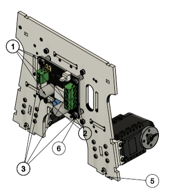
  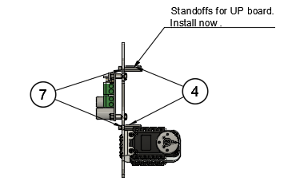
    
  [_Drawing 2B_](http://a360.co/2coACk9)

* Install the DFRobot DC-DC Power Convertor. The power convertor goes on the
  opposite side of the tower from the servos. Note the orientation of the
  connectors; when viewed from the side the power convertor is mounted on,
  the 5V output should be on the left. When viewed from the _back_, where the
  servos are, the 5V output will be on the right. Use 4ea. M3x6mm spacers, 
  4ea. M3 locknuts and 4 ea. M3x14 screws. 
  
* **Make sure the output voltage selection switch is in the 5V position.**

* Install standoffs for the UP board, but do not attach the UP board to the
  tower yet. We will install UP board after we organize the wiring, much of
  which will run underneath the UP board. Use 4ea M2.5x16 mm standoffs and
  4ea M2.5x6 screws. 

  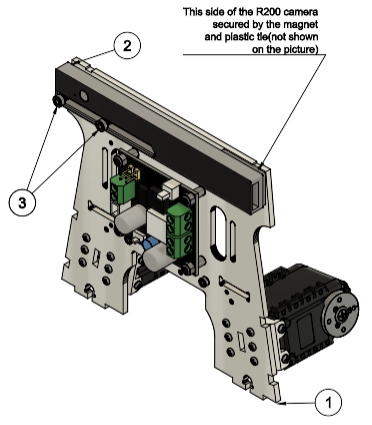
  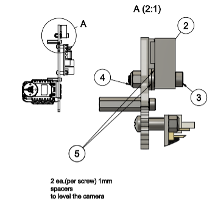

  [_Drawing 2C_](http://a360.co/2afYBTa)

* Install the Intel&reg; RealSense&trade; R200 3D Camera. Use 2ea M3x18 socket
  head screws, 2 ea. M3 locknuts, 1 ea. sticky magnet (included in camera kit)
  and 1 ea. cable tie. Use 4ea. (2ea. per screw) M3x1mm washers as a spacers
  between camera and Tower. 
  
* The following procedure is recommended to install the camera to ensure
  precise horizontal and vertical alignment:

    * Insert 1ea. M3x18 screw into slot in camera.
    
    * Add 2 ea. M3x1mm washers to the screw between camera and Tower.
    
    * Loosely secure screw with M3 locknut in the outer camera mount hole in the tower.
    
    * The camera should still be able to rotate and slide freely.
    
    * Attach the magnet to the other side of the camera, making sure it is in 
      an accurate position.  The bump in the magnet should be in the slot on 
      the back of the camera.
      
     * Remove protective paper from the magnet but do not stick it to the tower.
    
     * Align camera vertically and horizontally: the top edge of the camera 
       should be exactly aligned with the top tower edge.
    
     * Press sticky side of the magnet to tower.
    
     * Secure the locknut.
    
     * Secure the second screw with washers and a locknut.
    
     * Do not overtighten either screw. The locknuts and screws should hold 
       the camera firmly without bending the case of the camera.

2. Top Plate

  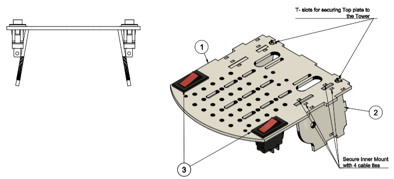

  [_Drawing 3A_](http://a360.co/2a3N9qc) 
  ([3D Assembly](http://a360.co/2a3nbTS))

* Attach 2 ea. Inner Mount Plates to the Top Plate and secure with 2 ties. 
  Leave ties semi loose. Don't cut ties excess length yet. 
  
* Install 2 ea. Switches.

  
u
  [_Drawing 3B_](http://a360.co/2a3n1Mc)

* Attach Top Plate to the Tower with 2 ea. M3x6 screws, M3 nuts, M3x1 washers
  in T-slots. 
  
    - NOTE: Using a little masking tape to hold the T-slot nuts in place during
      assembly can make this a lot easier.  
  
* Tighten ties and cut off excess tie length. 
  
* Install 2 ea. M3x51mm standoffs. Use 2ea. M3x8 button head screws.

* Secure Outer Mount Plate to the Servo with 8ea. M2x8 screws and 8ea. M2 hex
  nuts.  Repeat for the second Outer Mount.

  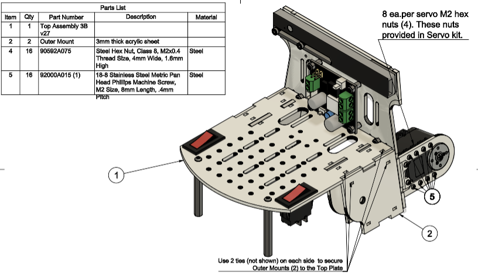

  [_Drawing 3C_](http://a360.co/2a3orGD)
    
* Attach Outer Mount Plates to Top Plate with ties.

3. Install Axles and Wheels but do not secure the M5 axle nut tightly yet. 
   Repeat for the second Wheel.
     
     - NOTE: It is possible to substitute an M6 nut and bolt for the M5
       shoulder bolt used here, as long as at least 12mm of the shaft of 
       the bolt is unthreaded and the unthreaded part of the shaft is actually
       6mm in diameter. Shoulder bolts are generally machined more exactly 
       than unthreaded bolts.
  
  
  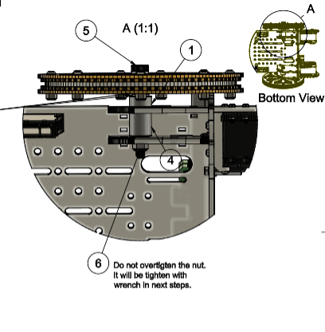

  [_Drawing 4_](http://a360.co/2a3nPRi)
  ([3D Assembly](http://a360.co/2a3N1Y2))
  
* At this point you may want to do the wiring as described in the 
  Wiring section below. However, it is relatively easy to take off the base
  plate later if necessary.

4. Base Plate

  

  [_Drawing 5A_](http://a360.co/2a3zOys)
  ([Base 3D Assembly](http://a360.co/2agoFxm))

  * Install the ball caster on the Base plate with 3ea. M3x8 screws and 3ea. 
    M3 locknuts. The basic design uses only one caster in the rear part of the
    robot, but you may add 2 more front casters if you want; this will reduce
    the ability of the robot to go over obstacles but will also make it less
    liable to tipping forward when decelerating. The extra mounting holes on
    the front of the Base Plate provide this option.  

      * Only the POM version of the base plate has flexible "suspensions" for 
        the casters.  If cut in Acrylic these have proven to break too easily 
	and so the basic version of the 3mm sheet omits them.
      * The frame is intentionally designed so that the casters do not all 
        touch the ground at the same time.

    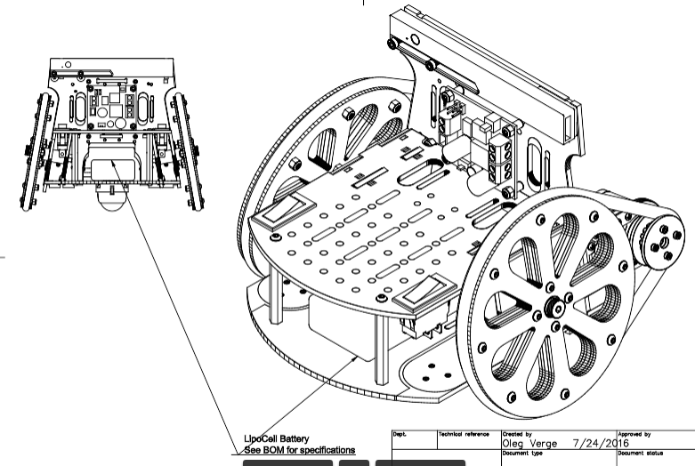

    [_Drawing 5B_](http://a360.co/2a88AGJ)

  * Insert Velcro straps in the slots of the Base Plate and install the 
    Battery. Overlap the straps underneath the robot so they can be loosened
    without taking off the Base Plate.
   
  * You should remove the battery after fitting it, then slide it back in 
    afterwards.  You might also want to fit the straps (and remove the battery 
    again) before fitting the Base Plate. 
  
    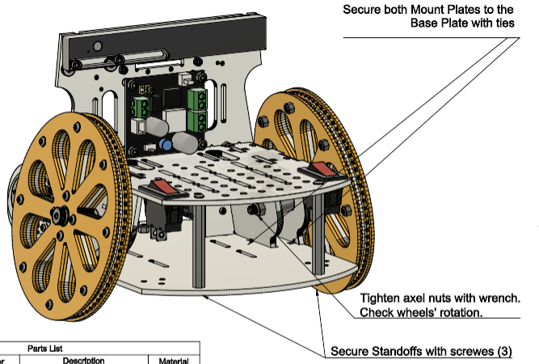
  
    [_Drawing 5C_](http://a360.co/2a3zYpA)
  
  * Secure front Standoffs to the Base Plate with 2 ea. M3x8 screws

  * Attach Base Plate to the Tower and secure it with 2ea. M3x6 screws, 
    3ea. M3 nuts, and 3ea. M3x1mm washers in T-slots.

    - NOTE: Using a little masking tape to hold the T-slot nuts in place during
      assembly can make this a lot easier.  
     
  * Secure Outer and Inner Mount Plates to the Base Plate with ties 
    (on both sides).
  
  * Tighten Axle bolt with a wrench. Check that Wheels rotate freely on the 
    Axle.

      * **Do not overtighten.**  

      * Best practice is to tighten until you start to feel slight resistance,
        then back off a half turn.

5. Driver and O-rings. 

  
  
  [_Drawing 6A_](http://a360.co/2a82vKJ)
  ([3D Assembly](http://a360.co/2akZt8Y))
  
  
  * Stack Driver components in your hand and align bolt holes.
    
  * Insert 4 ea. M2x20mm screws into stack, then secure driver onto the 
    servo hub.
  
  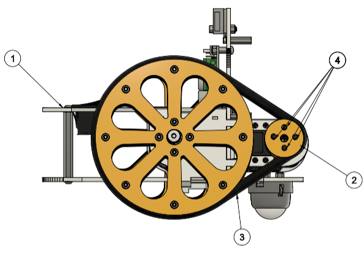 
  
  [_Drawing 6B_](http://a360.co/2akV7Pf) 

  * Install Driver and O-Ring by placing O-Ring over the Driver first
    and then stretching it around the grooves on the Wheel.

Wiring 
------
For ease of assembly you may want to complete wiring immediately after step 3 
of the mechanical assembly, eg before attaching the Base Plate. Otherwise,
you may want to remove the Base Plate temporarily.

6. Power

  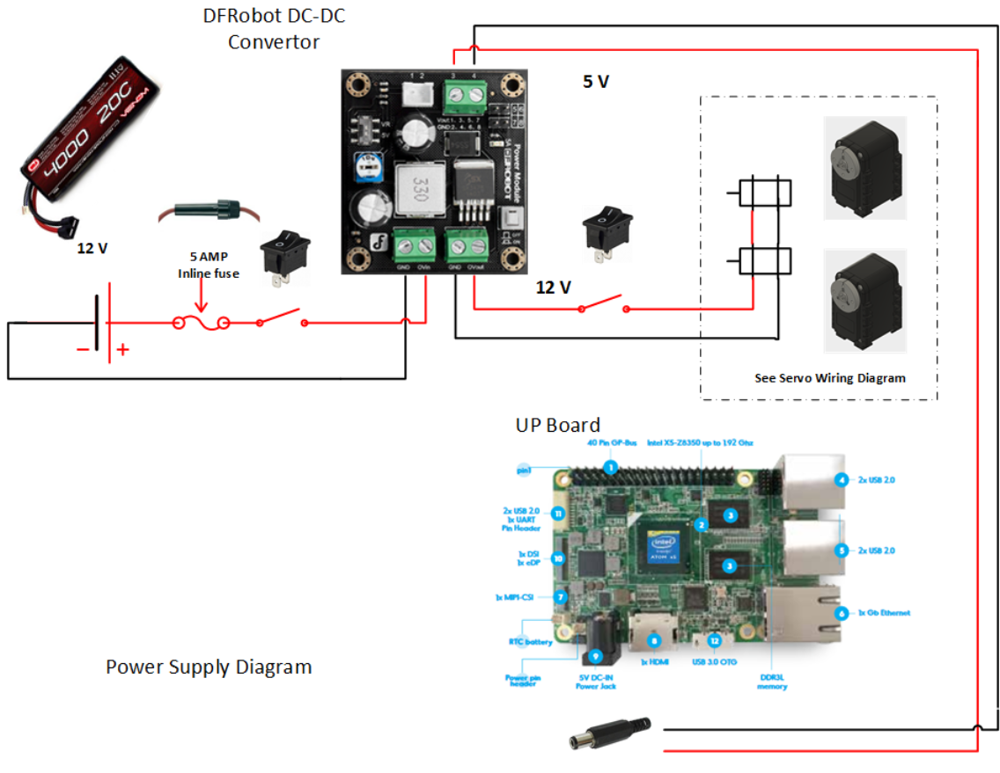
    
  [_Drawing 7: Power Supply Wiring Diagram_](http://a360.co/2a8p4yC)
    
  * In this design we are using Venom 20C 3S 4000mAh 11.1V LiPo Battery with
    a Universal Plug. In our tests this battery provides enough power for 
    about 60 min of active operation.

  * Main electrical power is distributed from the battery through an in-line 
    5 AMP fuse. The positive side is routed through the main power rocker 
    switch to the DC-DC convertor.  The DC-DC convertor provides 5V output
    but also provides a pass-through 12V connection. The pass-through 12V line
    is used to power the Servos using a modified Dynamixel cable while the 
    5V line is used to power the UP Board with a center-positive 5.1mm 
    barrel connector.

  * Pay special attention to the correct polarity of the wires when connecting
    to DC-DC convertor. If you get this wrong you can destroy your UP Board
    and/or your servos. 
    
      * It is **strongly** recommended to use a voltmeter to check both the 
        output voltage and the polarity before plugging in the servos or the 
	UP Board! 
	
      * See also the 
        [DFRobot Manufacturer Instructions](http://www.dfrobot.com/index.php?route=product/product&amp;product_id=752#.V5etZTU2eXg).

      * Double-check that the output voltage is set to 5V (small switch on the 
        DC-DC convertor).  Leaving this switch in the wrong position is another
	way to destroy your UP Board.

  * Also be careful when wiring up the power from the battery. We know of at 
    least one person that has completely destroyed a SAWR by wiring up their
    battery backwards.

7. Servo Wiring

   
   
  [_Drawing 8: Servo Wiring Diagram_](http://a360.co/2a8p5CN)
  
  * Connect USB2AX to 1st servo using a 250mm Dynamixel cable.
 
  * Interconnect both servos with Dynamixel 100mm cable.
  
  * Using a "custom" cable, connect the 2nd servo to the pass-through output
    power connector of the DC-DC power convertor.
  
      * This cable can be created by modifying a normal Dynamixel cable.
  
      * The "red" wire (the center wire of the Dynamixel cable) connects to 
        OVout on the pass-though screw terminal on the DC-DC convertor and the 
	"black" wire connects to GND on the same connector. 

          * See wiring diagram, and note especially the keying on the 
	    Dynamixel cables.
     
      * Unfortunately you will have to use the connector keying to distinguish
        the ground and the signal cables since they are not actually colored
	or labelled in any way!
 
      * The "red" wire of the custom cable has 2 female connectors that should
        be attached to the second rocker switch.
	
	  * This rocker switch will control power supply to motors only, which 
	    will allow you to turn off or reset the motors, but keep the UP 
	    Board powered. This is useful both to preserve battery life when
	    you need to work on UP Board configuration and programming, and
	    to stop the motors if necessary without crashing the UP Board.
  
8. USB Connections

  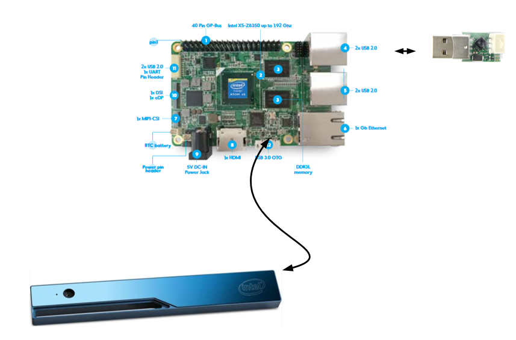 

  [_Drawing 9_: USB Connections](http://a360.co/2ajdTqA)
  ([USB Connection Diagram](http://a360.co/2ci6REp))

  * Connect the RealSense R200 Camera to the USB3 OTG port on the UP Board 
    with the short 3.0 micro-B to micro-B USB3.0 cable provided in the RDK.
     
  * Plug the USB2AX adapter into a (regular) USB2 port of the UP Board.

  * It is advisable to route camera and USB2AX cables in between the Tower 
    and UP Board. Address cable management and secure UP Board to the Tower 
    plate with 4ea. M2.5x6 screws. You may also want to capture the cables
    using cable management clips and/or cable ties.

     * Note that the USB3.0 plug on the UP Board is fragile and can be 
       broken off easily (guess how we know this...). Avoid putting vertical
       pressure on this cable. It is strongly advised to provide strain relief
       on the cable protruding from this port in particular.
     
  * Insert Wi-Fi USB dongle into UP board.
  
